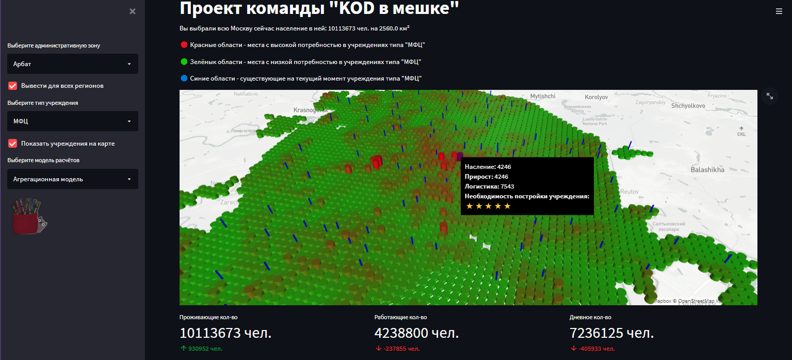
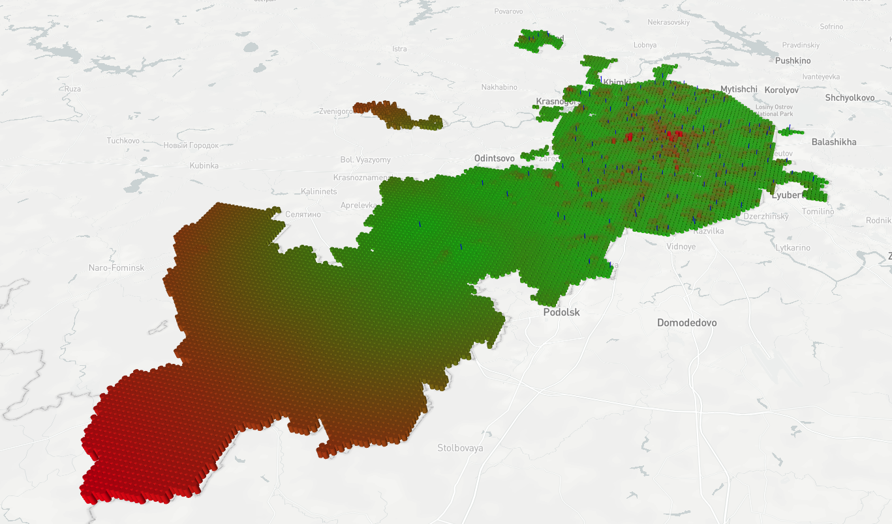
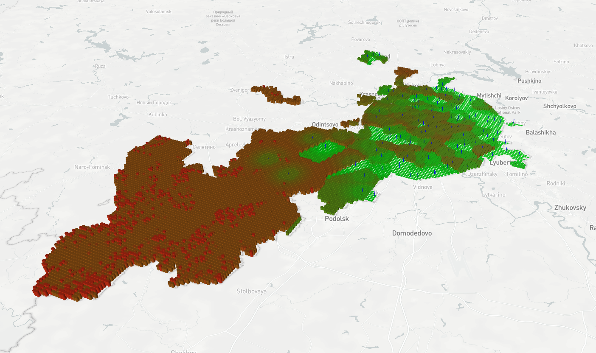

# Проект KOD в мешке
Данный проект - рекомендательная система по анализу текущей инфраструктуры города, плотности населения и динамики плотности населения.
С помощью данной системы вы можете определить нуждающиеся в учреждениях районы и ячейки.

# Установка
Установите необходимые библиотеки, предварительно установив pip и Python не ниже 3 версии

``pip install streamlit pydeck pyshp numpy pandas``

# Запуск
Запуск на текущий IP адресс осуществляется следующей командой:

``streamlit run siteMap.py``

Далее в консоль будет выведен IP адресс с портом, на которых находится запущенный интерфейс

# Интерфейс
В данном случае, включен режим отображения всех регионов, так же на карте отображаются все МФЦ синим цветом. При наведении курсора на области, отображается подсказка, описывающая необходимость МФЦ, а так же локальные для этой точки статистические данные.

На текущий момент в интерфейсе присутствует возможность выбора типа учреждений, но она не поддерживается, по причине отсутствия датасетов с другими учреждениями.

# Математические модели
## Агрегационная модель
В программе используется две математические модели, которые пользователь может выбрать сам.
Агрегационная модель, основанная на сумме плотностей и удалённости, нормированная в пределах от 0 до 5

Результат работы агрегационной модели:

## Балансовая модель
Так же в программе используется модель основанная на отношениях различных влияющих факторов.
Она расчитывает необходимость постройки соотнося текущую и максимальную загруженность, будущую загруженность, удалённость и логистику выбранной точки.
Модель также отнормирована в пределах от 0 до 5 

Результат работы балансовой модели:

